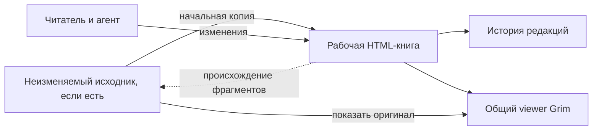
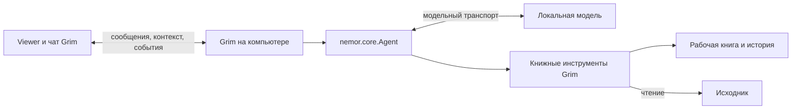

# Единая книга и локальный агент

Состояние на 2026-09-29: реализованы импорт EPUB в небольшие HTML-страницы,
локальный агент и одна рабочая копия по требованию. Кнопка «Создать рабочую
копию» оставляет основной документ в корне и создаёт видимую папку
`рабочая-копия/`. Её можно переименовать через интерфейс. Основной документ
проверяется по хешам, дальнейшие правки относятся к копии. Импорт и создание пустой книги не создают снимок
автоматически. Основной документ — главный: он открывается из библиотеки
и остаётся открытым после создания копии. Рабочая копия — дополнение,
выбираемое явно. Оверлеев нет.
[Хранение и ограничения](../README.md#оригинал-и-рабочая-копия),
[контекст и инструменты агента](local-agent.md).

Ниже сохранено архитектурное предложение от 2026-09-15. Карта соответствий,
полная история, отмена и перенос данных Coreader остаются будущей моделью;
они не входят в текущую систему рабочих копий.

Пользовательское направление: постепенно объединить Grim и llm-coreader;
сохранить внешний агент с файловым доступом и добавить локальный агент; совместить создание живой книги с рабочей
копией неизменяемого произведения. Проверка Android отложена.

## 1. Главная сущность — рабочая книга

Рабочая книга — самостоятельные HTML-страницы, оглавление и ресурсы. Её можно
читать, дополнять и изменять целиком. Исходное произведение, если оно есть,
сохраняется отдельно как неизменяемый снимок.

| Сценарий | Исходник | Начальное состояние рабочей книги |
| --- | --- | --- |
| Новая самопишущаяся книга | Отсутствует | Пустое оглавление |
| Импорт EPUB / подключение HTML | Снимок только по требованию | Импортированные / подключённые файлы |
| Перевод или адаптация | Тот же неизменяемый исходник | Копия, которую последовательно перерабатывают |
| Развитие существующей книги Grim | По желанию фиксируется её текущий снимок | Продолжение работы с текущими страницами |

Не нужно придумывать «пустой оригинал» для новой книги. Наличие исходника —
свойство происхождения книги, а не ограничение её редактирования.
Фиксация снимка самопишущейся книги позднее может дать ей исходную редакцию
для сравнения. Это не должно внезапно замораживать текущую рабочую книгу.

## 2. Три разных вида данных

**Содержимое.** Текущие страницы рабочей книги — источник истины для того,
что читает пользователь. История правок не участвует в сборке страницы
при каждом показе. Сначала достаточно одной рабочей версии на книгу.

**Происхождение.** Отдельная карта указывает, из каких исходных фрагментов
получен рабочий фрагмент. У перевода есть связь с оригиналом; у нового
примера может быть связь с объясняемым абзацем; у новой самостоятельной
главы соответствия исходнику может не быть. Связь «объясняет этот абзац»
отличается от «заменяет этот абзац». Это происхождение и редакторский смысл,
а не гарантия достоверности текста.

**История.** Сохраняет редакции и операции: создание, замена, вставка,
перемещение, удаление; автор, предыдущее состояние и родительская редакция.
Позволяет посмотреть изменения и вернуться к предыдущей редакции.
Отмена старой правки после последующих изменений — отдельная операция с
проверкой конфликта, а не отключение произвольного старого наложения.

Пример: один абзац оригинала переведён, затем расширен двумя примерами и
перенесён в другую главу. Это всё ещё одна текущая рабочая книга. Связь с
оригиналом сохраняется на уровне преобразованного фрагмента; у примеров
свои ID. История позволяет увидеть оба этапа работы.

## 3. Как это выглядит для читателя

- По умолчанию открывается основной документ. Рабочая копия — дополнение к нему.
- При наличии копии доступно переключение «Оригинал / Рабочая копия».
- «Показать исходный фрагмент» ведёт к соответствующему месту. При
  приблизительном соответствии интерфейс не обещает точности до символа.
- Для добавленной главы честно показывается отсутствие прямого соответствия.
  Возврат из оригинала возвращает к предыдущему рабочему месту.
- «История» показывает изменения и восстановление редакции.
- Чат принадлежит книге и может работать и с оригиналом, и с рабочей версией.

При сильной переработке соответствия часто имеют вид «несколько абзацев к
нескольким абзацам». Простое масштабирование символьных смещений между
текстами нельзя считать точным сопоставлением. Удалённые фрагменты также
нужны карте соответствий: иначе навигация из оригинала потеряет их след.

## 4. Локальный агент

Первый реализованный вариант — процесс Grim на компьютере, встроенный runtime
Nemor и явно настроенное подключение к локальной модели. Это схема Coreader
с использованием актуальной границы библиотек. Исполнение модели на Android
в неё не входит; телефон позже станет клиентом того же сервиса.

Из Coreader полезны сохранённые разговоры, задания с устойчивыми ID,
восстановление результатов после разрыва связи, настройки модели и книжные
инструменты. Конкретные импорты нужно адаптировать:

- Coreader `server/coreader_server/runtime.py` импортирует `nemor.core.agent`
  и прежние `AgentApplication`, `SessionManager`, `TurnContext` и другие типы.
- В текущем соседнем Nemor этих интерфейсов в core уже нет. Публичный
  `nemor.core.Agent` принимает модельный `completion`, `Session`, `ToolRegistry`.
- Хранение разговоров и адаптеры находятся выше core; актуальный
  `nemor/agent/storage.py` содержит `SessionManager`. Сборку приложения и
  книжную идентичность должен задавать Grim.
- Повтор доставки сообщения дедуплицируется по ID задания и payload.
  Повтор записи инструментом отдельно защищается ID операции и редакцией.
  Это разные гарантии: один лишь устойчивый job ID не исключает повторного
  добавления абзаца после аварии посреди агентного хода.

Предлагаемый набор инструментов:

| Группа | Возможности |
| --- | --- |
| Контекст | Какая книга, какая версия, страница, выделение и видимый текст |
| Чтение | Оглавление, поиск, чтение страниц и исходных фрагментов |
| Запись | Создать страницу, заменить фрагмент, изменить оглавление, добавить ресурс |
| Проверка | Прочитать результат, показать изменения, найти исходное соответствие |

Все изменения направляются в рабочую книгу. Новые главы, пояснения, перевод,
картинки и интерактивные HTML/JS-материалы используют один путь записи.
Текущий XHTML-фильтр Coreader для литературных замен недостаточен для Grim:
он запрещает скрипты и обработчики, тогда как интерактивность — часть
книжного формата Grim. Отдельные операции над страницами и ресурсами должны
сохранять текущую песочницу viewer.

По явному требованию пользователя внешний самостоятельный агент сохраняется
наряду с локальным. Сейчас он получает контекст через прежний API и правит
файлы напрямую; общий публичный API книжных операций можно добавить позже. Свободный файловый
доступ, который есть у него сейчас, не даёт автоматически точной истории
и происхождения — это отдельный случай, описанный ниже.

## 5. Контекст и защита от устаревшей правки

К отправленному сообщению прикладывается снимок контекста именно в момент
отправки: `book_id`, `reader_id`, версия (`source` или `working`), редакция,
страница, якорь, выделение и видимый текст. Последующая прокрутка не меняет
смысл уже отправленной реплики. При необходимости агент отдельно читает
свежий контекст. Текст книги и цитаты остаются данными, а не инструкциями.

Агент читает содержимое через инструменты, затем передаёт точный фрагмент
либо полученный адрес вместе с токеном прочитанной редакции. Сервер проверяет
адрес и редакцию в одной операции записи. При конфликте нужно перечитать
фрагмент. Старое выделение из DOM не является канонической целью записи.

Существующий in-memory счётчик `revision` watcher в Grim пригоден для
обновления вкладок, но не заменяет долговечную идентичность редакции.
Проверка исходника должна охватывать и связанные CSS/изображения/JS: общий
изменяемый файл ресурсов мог бы незаметно изменить показ «оригинала».

## 6. Совместимость с книгой как папкой

Сохранить текущие HTML-файлы, `book.json`, пути страниц и ID книг. Существующая
папка становится рабочей книгой без обязательного импорта и конвертации.
Исходники, история и карта соответствий добавляются как отдельные данные.
Конкретное расположение служебного хранилища нужно выбрать при реализации
с учётом переноса книжной папки и синхронизации ресурсов.

Общие правила для будущего слоя записи:

1. Управляемая запись сохраняет предыдущее состояние, проверяет редакцию,
   применяет изменения и публикует новую редакцию. Для нескольких файлов
   читатель должен получать согласованный снимок.
2. Прямая файловая правка внешнего агента остаётся допустимой. Watcher
   фиксирует обнаруженное состояние как внешнее изменение; для изменённых
   фрагментов неподтверждённые соответствия помечаются устаревшими.
   Промежуточные состояния между опросами watcher восстановить невозможно.
3. Безопасные исходные снимки не являются целями книжных write-инструментов.
   Хеш проверяет их целостность; это не защита от процесса с произвольным
   доступом ко всей файловой системе.
4. При импорте сохранить исходный EPUB/FB2 побайтно и отдельно его
   представление для чтения. DOM браузера не становится исходником книги.

## 7. Порядок реализации

1. Локальный агент и чат на компьютере: настройки подключения, текущий
   Nemor, сохранённый разговор, снимок контекста, чтение и поиск книги.
2. Единый слой записи рабочей книги: создание/изменение страниц и ресурсов,
   оглавление, долговечная редакция, история, проверка конфликтов.
   На этом этапе агент уже может дописывать существующие книги Grim.
3. Неизменяемый исходник и начальная рабочая копия. Импорт проверяется
   отдельно от переключения представлений и карты соответствий.
4. Происхождение фрагментов и переключение к соответствующему месту.
   Затем перенос готовых рабочих документов Coreader с сохранением ID,
   разговоров и происхождения; устаревшие overlay-правки материализуются
   один раз, сверяются с текущим рабочим документом и не рендерятся повторно.
5. Подключение Android к тому же книжному сервису и локальная реплика.

При переносе брать механизмы и данные Coreader по одному контракту. Его
активные задачи #2095, #2110 и #2111 показывают незавершённость старой
миграции; сам факт наличия кода не означает завершённую реализацию функции.
